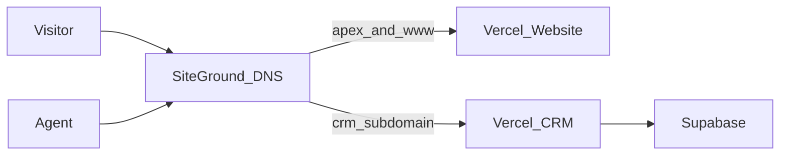

# Domain & dual-project deployment

Enamorado uses **two Vercel projects** from one GitHub repo:

| Vercel project | Root directory | Production domain |
|----------------|----------------|-------------------|
| Enamorado Website | `website` | `enamoradoinsurancefl.com` + `www.enamoradoinsurancefl.com` |
| Enamorado CRM | `app` | `crm.enamoradoinsurancefl.com` |

DNS is managed at **SiteGround** (or your registrar). SSL is issued by Vercel after domains are verified.

---

## 1. Vercel — Website project

1. Import [github.com/JCDATASCIENTIST/enamoradocrm](https://github.com/JCDATASCIENTIST/enamoradocrm).
2. **Root Directory:** `website`
3. Framework: Next.js (auto-detected)
4. Deploy once on the default `*.vercel.app` URL and verify pages load.
5. **Settings → Domains** → add:
   - `enamoradoinsurancefl.com`
   - `www.enamoradoinsurancefl.com`
6. Set `www` to redirect to apex (or vice versa — pick one canonical host in Vercel).

No Supabase or cron env vars are required for the marketing site.

---

## 2. Vercel — CRM project

1. Import the **same repo** again (second Vercel project).
2. **Root Directory:** `app`
3. Add all CRM env vars (see [deployment-staging.md](./deployment-staging.md)).
4. **Settings → Domains** → add `crm.enamoradoinsurancefl.com` only.

Set `NEXT_PUBLIC_APP_URL=https://crm.enamoradoinsurancefl.com` in production.

---

## 3. SiteGround DNS records

Vercel shows the exact values after you add each domain. Typical setup:

### Apex domain (`enamoradoinsurancefl.com`)

**Option A — A record (common on SiteGround)**

| Type | Name | Value |
|------|------|-------|
| A | `@` | `76.76.21.21` |

**Option B — CNAME flattening** (if SiteGround supports ALIAS/ANAME at apex)

Follow the record Vercel displays in the Domains panel.

### WWW

| Type | Name | Value |
|------|------|-------|
| CNAME | `www` | `cname.vercel-dns.com` |

(Vercel may show a project-specific CNAME — use what the dashboard displays.)

### CRM subdomain

| Type | Name | Value |
|------|------|-------|
| CNAME | `crm` | `cname.vercel-dns.com` |

Point this CNAME to the **CRM** Vercel project’s target (shown in that project’s Domains settings).

---

## 4. Verification checklist

### Website

- [ ] https://enamoradoinsurancefl.com loads home page
- [ ] https://www redirects to canonical host
- [ ] `/services`, `/about`, `/contact` work
- [ ] “Agent login” opens `https://crm.enamoradoinsurancefl.com/login`

### CRM

- [ ] https://crm.enamoradoinsurancefl.com/login works
- [ ] Apex domain does **not** serve CRM (only subdomain)
- [ ] Cron and Zapier env vars set on CRM project only

---

## 5. Architecture



---

## 6. CLI quick reference

From repo root:

```bash
# Website preview deploy
cd website && npx vercel

# Website production
cd website && npx vercel --prod

# CRM production (from app/)
cd app && npx vercel --prod
```

Link each folder to its own Vercel project on first run (`vercel link`).

---

## Related docs

- [website/README.md](../website/README.md)
- [app/README.md](../app/README.md)
- [deployment-staging.md](./deployment-staging.md)
- [handoff/Architecture-Diagram.md](../handoff/Architecture-Diagram.md)
