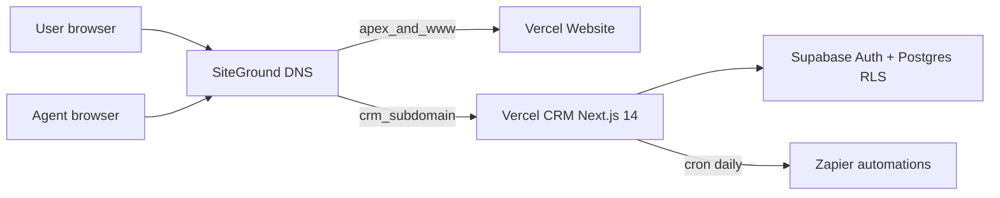

# Architecture overview

## Components

| Layer | Technology |
|-------|------------|
| Public website | Next.js 14, Tailwind — `website/` |
| CRM app | Next.js App Router, Tailwind — `app/` |
| Hosting | Vercel (two projects, one repo) |
| Database + Auth | Supabase (CRM only) |
| Automations | Zapier (CRM webhooks, Path B payloads) |
| DNS | SiteGround → apex + `www` → website; `crm` → CRM |

## Security

- Session cookies via `@supabase/ssr`
- RLS on all application tables
- Service role only on server for admin invite and cron
- Audit log append-only via SECURITY DEFINER triggers
