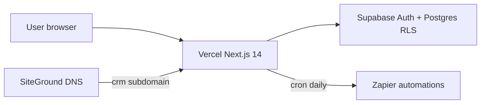

# Architecture overview

## Components

| Layer | Technology |
|-------|------------|
| Frontend | Next.js App Router, Tailwind |
| Hosting | Vercel |
| Database + Auth | Supabase |
| Automations | Zapier (webhooks, Path B payloads) |
| DNS | SiteGround → `crm.enamoradoinsurancecompany.com` |

## Security

- Session cookies via `@supabase/ssr`
- RLS on all application tables
- Service role only on server for admin invite and cron
- Audit log append-only via SECURITY DEFINER triggers
