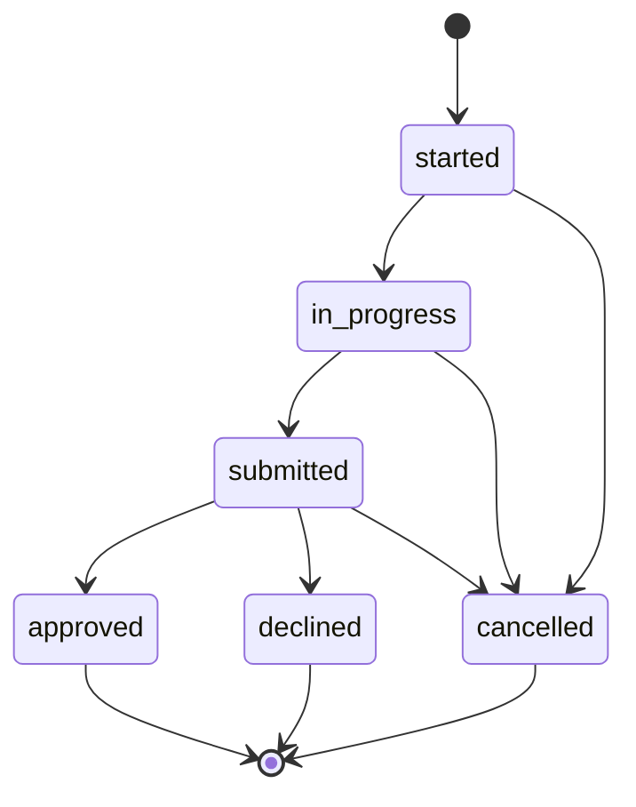

# Enrollment activity flow

Agent runbook for recording enrollment progress from first touch through terminal status.

## Purpose

Track each enrollment attempt per contact with status history and optional external reference (enrollment tool or carrier confirmation ID).

## Status progression

Setting a terminal status (`approved`, `declined`, `cancelled`) sets `completed_at` automatically.

## Actors

| Role | Can do |
|------|--------|
| Agent | Create enrollment, update status for assigned/unassigned contacts |
| Admin | Full CRUD on all enrollments |
| Read-only | View only |

## Step-by-step (agent)

### 1. Confirm contact is ready

- Contact should be **client** (promote from prospect if needed).
- Plan type, carrier, and effective date filled on contact record.
- Notes capture any special circumstances.

### 2. Start enrollment

1. Go to **Enrollments** (`/enrollments`).
2. Click create / inline form.
3. Select contact, set status **started**.
4. Optional: enter `external_ref` (portal application ID, carrier confirmation).
5. Add description (e.g. "MA enrollment — AEP").

### 3. Work in progress

- Update status to **in_progress** when application is being completed.
- Add contact notes after each carrier portal session or client call.

### 4. Submit to carrier

- Set status **submitted** when application is sent.
- Record submission date in description or note.

### 5. Terminal outcome

| Outcome | Status | Follow-up |
|---------|--------|-----------|
| Approved | `approved` | Update contact plan fields; set `effective_date`; log commission |
| Declined | `declined` | Note reason; set follow-up for alternative plan |
| Cancelled | `cancelled` | Note why; return to pipeline if still prospecting |

### 6. Commission (if approved)

1. Go to **Commissions** → create record linked to contact.
2. Enter carrier, amount, writing agent, status `pending`.
3. Update to `paid` when carrier pays.

## Integration scope (v1)

- **Default:** Manual entry only; `external_ref` is free text.
- **Change order:** One carrier/enrollment-tool API per Discovery Document §8.

## RLS note

Enrollment write access follows parent contact assignment (same as commissions).

## Related docs

- [Enrollment-Workflow-Spec.md](../workstream-b/Enrollment-Workflow-Spec.md)
- [Commission-Tracking-Spec.md](../workstream-b/Commission-Tracking-Spec.md)
- [user-guides/Agent-User-Guide.md](../user-guides/Agent-User-Guide.md)
