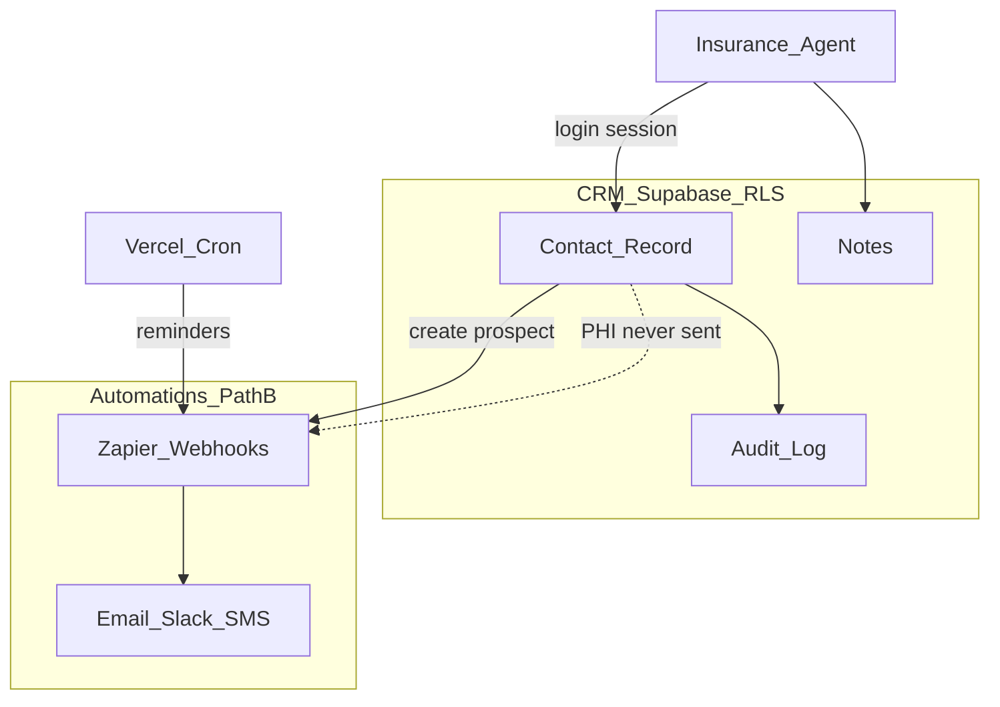

# HIPAA data handling flow (Path B)

How sensitive data enters the CRM, stays in Supabase, and what may leave via automations.

## Posture decision

**Path B (current):** Operational CRM data with strict boundaries. No full Medicare/MBI, Medicaid IDs, or SSNs. Member ID **last 4 digits only**. Automations (Zapier) receive **non-PHI** payloads only.

If the agency later requires full PHI storage, that is a **change order** requiring Supabase BAA, HIPAA project config, and revised automation design.

## Data classification

| Data | In CRM (Supabase) | In Zapier webhooks | Notes |
|------|-------------------|--------------------|-------|
| Name | Yes | display_name only | |
| DOB | Yes | **No** | Used for age filters, birthdays |
| Phone, email, address | Yes | **No** | Contact inside CRM only |
| Member ID last 4 | Yes (max 4 digits) | **No** | Validated in UI + server |
| Full member / Medicare ID | **No** | **No** | Blocked by phi-guard |
| Plan, carrier, stage | Yes | Yes (subset) | Path B payloads |
| Renewal / follow-up dates | Yes | Yes | Dates only, no contact PII |

## Flow diagram

## Enforcement layers

1. **UI / forms** — labels warn Path B; member ID field max 4 digits
2. **Server actions** — `validateMemberLast4`, `checkShortIdField` in `app/lib/hipaa/phi-guard.ts`
3. **Zapier payloads** — typed in `app/lib/zapier/payload.ts`; no PHI fields defined
4. **CSV import** — PHI pattern checks on import
5. **RLS** — role-based access on all tables
6. **Audit log** — append-only record of changes (admin read)

## Zapier allowed fields (summary)

| Event | Allowed fields |
|-------|----------------|
| new_prospect | contact_id, display_name, contact_type, stage, plan_type, assigned_to_name |
| follow_up_reminder | contact_id, display_name, follow_up_date, follow_up_status |
| renewal_reminder | contact_id, display_name, renewal_date, days_until, carrier, plan_name |

## Agent rules

- Do not paste full Medicare or Medicaid numbers into any field.
- Do not put SSNs in notes.
- Use CRM for outreach (phone/email from contact record); Zapier notifications are **alerts only**.
- Report suspected PHI in wrong place to admin immediately.

## Incident response

If PHI appears in Zapier or email from automation:

1. Turn off affected Zap
2. Clear webhook URLs in Vercel until reviewed
3. Follow [sops/Security-Incident-Response-SOP.md](../sops/Security-Incident-Response-SOP.md) (when published)
4. Document in audit / change log

## PR checklist (developers)

Any change touching `lib/zapier/`, cron routes, or export/import:

- [ ] Path B field audit in PR description
- [ ] No new PHI fields in webhook JSON
- [ ] Manual test with sample payload reviewed

## Related docs

- [04-Risk-Register.md](../04-Risk-Register.md) — Risk 1 HIPAA/PHI
- [Zapier-Automation-List.md](../workstream-b/Zapier-Automation-List.md)
- [Renewal-Reminder-Flow.md](./Renewal-Reminder-Flow.md)
