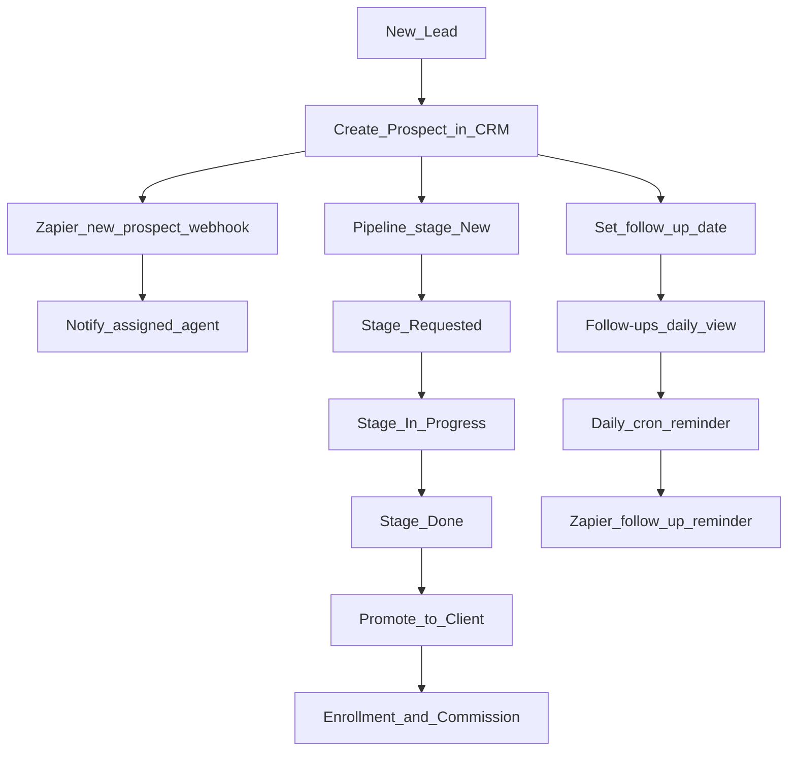

# New prospect intake flow

End-to-end flow from lead entry through pipeline, follow-up, and client promotion.

## Purpose

Standardize how agents and admins capture new leads, advance the sales pipeline, and convert prospects to clients.

## Flow diagram

## Step-by-step

### 1. Create prospect

1. **Clients & Prospects** → **+ New contact**
2. Required: first name, last name
3. Set **contact type** = prospect
4. Set **stage** = new (default)
5. Assign agent if known
6. Set **follow_up_date** and status pending
7. Save

**Automation:** Creating a prospect fires `ZAPIER_NEW_PROSPECT_WEBHOOK` with Path B payload (name, stage, plan type, assignee name — no phone/email).

### 2. First contact

1. Open contact detail from notification or list
2. Log call/email in **Notes**
3. Move pipeline card: **New** → **Requested** (kanban or detail)

### 3. Active work

1. Stage **In Progress** while gathering info or quoting
2. Update plan type, carrier, Medicaid level as learned
3. Keep follow-up date current

### 4. Close or advance

- **Done** when ready to enroll or client declines
- If enrolling: **Promote to client** on contact detail
- Start enrollment activity (see [Enrollment-Activity-Flow.md](./Enrollment-Activity-Flow.md))

### 5. Follow-up discipline

1. **Follow-ups** page each morning (see [Agent-Monday-Morning-Checklist.md](../handoff/Agent-Monday-Morning-Checklist.md))
2. Complete, skip, or snooze tasks
3. Pending follow-ups due within 7 days included in daily cron → Zapier

## Roles

| Action | Admin | Agent | Read-only |
|--------|-------|-------|-----------|
| Create prospect | Yes | Yes | No |
| Edit unassigned | Yes | Yes | No |
| Edit assigned to other | Yes | No | No |
| Move pipeline | Yes | Assigned/unassigned | No |
| Promote to client | Yes | Yes (if can edit) | No |
| Delete contact | Yes | No | No |

## Related docs

- [user-guides/Agent-User-Guide.md](../user-guides/Agent-User-Guide.md)
- [Zapier-Automation-List.md](../workstream-b/Zapier-Automation-List.md)
- [HIPAA-Data-Handling-Flow.md](./HIPAA-Data-Handling-Flow.md)
