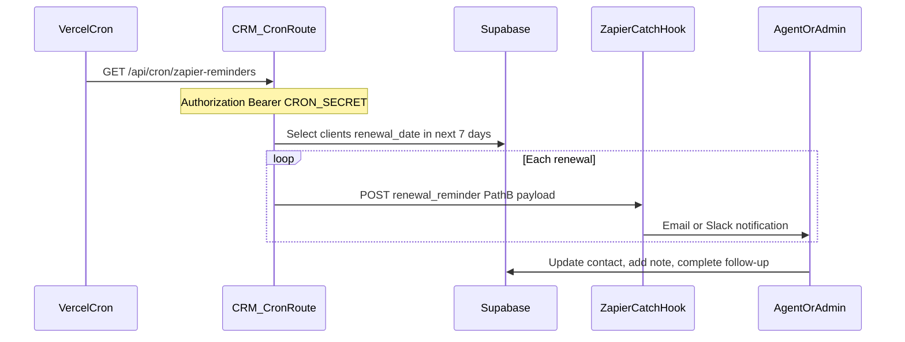

# Renewal reminder flow

Operational runbook for daily renewal notifications from CRM → Zapier → staff.

## Purpose

Alert agents and admins when a **client** policy renewal is due within 7 days, using Path B payloads only (no PHI in Zapier).

## Actors

| Role | Responsibility |
|------|----------------|
| Agent / Admin | Sets `renewal_date` on client contacts |
| Vercel Cron | Triggers batch job daily at 13:00 UTC |
| CRM API | Queries eligible clients, POSTs to Zapier |
| Zapier | Routes to email, Slack, or SMS |
| Staff | Acts on renewal from `/renewals` dashboard |

## Flow diagram



## Eligibility rules

From `app/app/api/cron/zapier-reminders/route.ts`:

- `contact_type = client`
- `renewal_date` is not null
- `renewal_date` between today and today + 7 days (inclusive)
- One webhook POST per matching contact per cron run

Dashboard buckets on `/renewals` (manual views):

| Tab | Rule |
|-----|------|
| Overdue | `renewal_date < today` |
| Due (7 days) | `today <= renewal_date <= today+7` |
| Upcoming (30 days) | `today+7 < renewal_date <= today+30` |

## Payload (Path B)

```json
{
  "event": "renewal_reminder",
  "contact_id": "uuid",
  "display_name": "Jane Doe",
  "renewal_date": "2026-06-20",
  "days_until": 6,
  "carrier": "Humana",
  "plan_name": "Gold Plus HMO"
}
```

**Never sent:** DOB, phone, email, address, member IDs.

## Staff steps after notification

1. Open **Renewals** → **Due (7 days)** tab (or search contact by name in CRM).
2. Review plan, carrier, and renewal date on contact detail.
3. Call or email client using contact info **inside CRM only** (not from Zapier).
4. Add a note documenting outreach.
5. Update `renewal_date` or `follow_up_date` if snoozing.
6. Log commission or enrollment activity if applicable.

## Configuration checklist

- [ ] `CRON_SECRET` set in Vercel production
- [ ] `ZAPIER_RENEWAL_REMINDER_WEBHOOK` set to Catch Hook URL
- [ ] Zap published (see [workstream-b/Zapier-Automation-List.md](../workstream-b/Zapier-Automation-List.md))
- [ ] Cron tested manually once with Bearer token
- [ ] Timezone reviewed: cron is 13:00 UTC — adjust Vercel schedule if agency prefers local morning

## Troubleshooting

| Symptom | Check |
|---------|-------|
| No Zap fires | Webhook URL empty in env; Zap not turned on |
| 401 on cron | `CRON_SECRET` mismatch |
| Wrong contacts | `renewal_date` null or contact still `prospect` |
| Duplicate emails | Zapier dedupe filter on `contact_id` + `renewal_date` |

## Related docs

- [Renewal-Tracking-Spec.md](../workstream-b/Renewal-Tracking-Spec.md)
- [Zapier-Automation-List.md](../workstream-b/Zapier-Automation-List.md)
- [handoff/Launch-Checklist.md](../handoff/Launch-Checklist.md)
